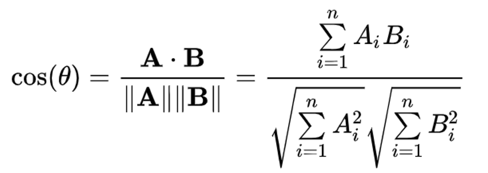

# Semantic-Embedding

In this project, we build a prototype Question 
Answering System by using the semantic information 
embedded in a Distributional Semantic Model (DSM) file 
called "glove.6B.50d_Reduced.csv".


- By providing a specific word, we would like the system to be able to find a list of words that are semantically close to it. E.g. By saying "Computer", the system should list "Software", "Technology", "Internet", "Computing" and "Devices" as the top 5 closest words. Or "Doctorate", "Bachelor", "Thesis", "Dissertation" and "Graduate" should be the top 5 closest words to "PhD".

 - For Further information, please read [Chapter 6 of Speech and Language Processing, Stanford University.](https://web.stanford.edu/~jurafsky/slp3/6.pdf)
# Acknowledgements

 - I am grateful to the dedication of [Dr. Dan Jurafsky](https://web.stanford.edu/~jurafsky/) and [Dr. James H. Martin](https://home.cs.colorado.edu/~martin/). Their expertise have significantly advanced our understanding of speech and language technologies, shaping the way we interact with and analyze textual and spoken data. Their comprehensive and insightful approach in the book [Speech and Language Processing](https://web.stanford.edu/~jurafsky/slp3/) has served as a fundamental resource for researchers, students, and practitioners alike, providing a solid foundation in the study of speech recognition and natural language processing.
<!-- TOC --><a name="table-of-contents"></a>
## Table of Contents
- [Word Embedding and GloVe](#word-embedding-and-glove)
- [DSM File](#dsm-file)
- [Extracting semantic information from vector representations](#extracting-semantic-information-from-vector-representations)
- [Running the program](#running-the-program)


<!-- TOC --><a name="word-embedding-and-glove"></a>
## Word Embedding and GloVe

Computational linguistics research holds that word meaning can be represented by its contextual information because similar contextual distributions tend to share between semantically similar words. The idea of Distributional Semantic Models (DSM), which have also been referred to as word space or vector space models, is that the meaning of words can, to a certain extent, be inferred from their usage and therefore the semantics can be encapsulated in high-dimensional vectors based on the nearby co-occurrence of words.

- One of the most significant benefits of representing words with high-dimensional vectors is that the number-based representation can then be used as the input for further numerical processing, e.g. input for a neural network (NN). Hence, to a certain extent, DSM is simply a vectorisation or encoding process.
<p></p>

- Many remarkable methods or frameworks have been developed in this area. For example, Word2Vec and Global Vectors for Word Representation (GloVe). In this project, we are going to use a DSM generated by the GloVe method. 
<p></p>

<p></p>

- GloVe is a model for distributed word representation. The model is an unsupervised learning algorithm for obtaining vector representations for words. 


<!-- TOC --><a name="dsm-file"></a>
### DSM File

The file is called "glove.6B.50d_Reduced.csv" which includes 38,534 unique words.
<p></p>

- The DSM file ```java code\src\main\resources``` contains words and their respective vector representation.
<p></p>

- Each line starts with a unique word, then followed by 50 floating numbers (separated by ","). These floating numbers are the vector representation of that word. 
<p></p>

- Using the word "abacus" as an example, the first element in its vector representation should be "0.9102".

<!-- TOC --><a name="extracting-semantic-information-from-vector-representations"></a>
## Extracting semantic information from vector representations

Based on the DSM theory, there is a clustering/grouping trend for words with similar meanings. Using the below figure (Fig. 1)  as an example, originally, it has been used to explain how Word2Vec understands semantic relationships, like Paris and France are related the same way Beijing and China are (capital and country), and not in the same way Lisbon and Japan are.
<p></p>

- Consequently, those words that represent the concept of “Country” have been grouped together and separated from those that represent the “Capital” concept.

<p></p>


- Moreover, the "closeness" of two words can be measured by the called Cosine Distance/Similarity. CS is a measure of the cosine of the angle between two non-zero vectors (θ). The following equation for cos(θ) is:




- So, back to the "Computer" examples mentioned at the beginning of the document. To identify the closest word to "Computer", we can calculate its CS value with all the other words included in the DSM file. Then the higher the CS value is, the closer a word is to "Computer".

<!-- TOC --><a name="running-the-program"></a>
# Running the program

- Clone this repository to your local machine.
  
<p></p>

```
git clone https://github.com/hyperFounder/Semantic-Embedding
```

- Open the ```/java code``` folder in IntelliJ IDEA or any other IDE. Navigate to ```\src\main\java```.
<p></p>

- Run ```SemanticMain.java``` in ```\src\main\java```.

# License
This project is licensed under the [GNU General Public License v3.0](https://github.com/hyperFounder/Semantic-Embedding/blob/main/LICENSE).


  

